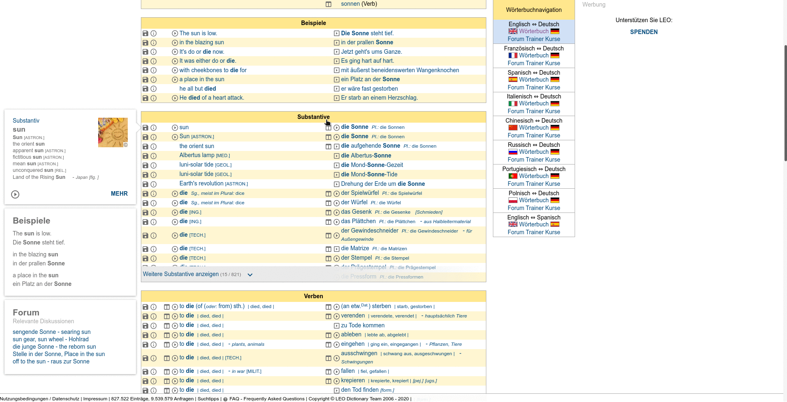

# ProNunciation

Download voice samples from [LEO Online Dictonary](https://dict.leo.org/) or [Google Translate](https://translate.google.com) and saves them as .mp3 files.

We try to get audio files from [LEO](https://dict.leo.org/) (human voices, robot generated voices in Leo are ignored because, in this case, Google's synthetic voice is better.). In case we can't find the audio file we are looking in Leo, we get it from Google translate.

This can be useful when you want to get audio files to use it in your Anki decks, for example (my case).

## Dependencies

### Python

You need at least `python>=3.6` to run this script.

What things you need to install and how to install them.

```python
google_speech==1.1.0
unidecode==1.1.1
```

You can install them either manually or through the command:

```bash
pip install -r requirements.txt
```

### System

`sudo apt-get install sox libsox-fmt-mp3`

## Usage

Normally you will use this script like this:

`python pro_nunciation.py --word "Die Sonne"`

You will be informed from where the audio is coming from (Google translate or LEO);

It will generate a `DE_die_sonne.mp3` file in the current directory.

### Advanced & Troubleshooting

In case the script magic is not working, you can force some stuff.

To force Google Translate engine:

`python pro_nunciation.py --word "Die Sonne" --force_google 1`

In the worst case scenario, if the script cannot recognize the correct audio file from LEO (and brings the wrong things or simply falls back to Google Translate), you can provide the audio code yourself.

The following GIF should well illustrate the process:



0) Do the search on LEO for the word you are looking for;

1) Open the `Element Inspector` from your browser;

2) Use the mouse to select the play button, like you would do if you wanted to play it (it will probably play anyways);

3) Then, at the region highlighted by the inspector, look for the value associated with the `data-dz-rel-audio` property, that is the code you need.

In the tutorials case, the copied code was `R9ic4hBwCrJUSuBxmN3XRA`, so the final command would be:

`python pro_nunciation.py --word "Die Sonne" --leo_code R9ic4hBwCrJUSuBxmN3XRA`

> if the `--word` is not provided in this case, the script will still work, but be aware that you will end up with a `random_leters.mp3` in your folder.

## Known limitations

This script is far from perfect. Some of the following issues can be fixed with relative ease, so if any of the following issues is affecting you more than you would like, have a look at the [Support Section](#Support) bellow or, if you can, contribute!

Here are some limitations that a user can encounter when using the script.

> note that these limitations can be bypassed following the the steps shown [here](#Advanced-&-Troubleshooting).

### Leo has the audio files but the script is unable to get it

This happens because, for some reason, Leo's entry for that word does not include an audio file of the original audio

## Support

If you would like to see a new functionality, have a suggestion on how to make the documentation clearer or report a problem, you can open an [issue](https://github.com/danilown/FileListDataset/issues/new) here on Github or send me an e-mail danilownunes@gmail.com.
